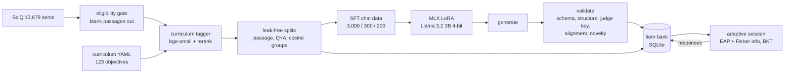

# EduAI

EduAI generates AP-style multiple-choice science questions with Llama 3.2 3B, either the base
model with two fixed examples or a LoRA adapter trained here (the eval compares both).
An embedding-based tagger maps questions to learning objectives, and an adaptive test chooses
each next question from the student's earlier responses. It covers Biology, Chemistry,
Physics 1 and Environmental Science using SciQ source material. The pipeline runs on one
M1 Pro laptop.

<p>


</p>



## Quickstart (no model or API key)

```bash
make setup-demo   # installs only core app dependencies; package download may need network
make demo         # bank-only app on http://127.0.0.1:8001
```

The demo serves a committed sample of 634 SciQ-derived items (`data/samples/bank_sample.jsonl`)
and 32 validated generated items. It needs neither the raw dataset nor a model. In the browser,
choose Biology, start a 10-question practice session, answer a few questions to see source-passage feedback and unit progress, then
open the report. Assessment mode withholds the answer until the session ends and shows an
illustrative ability estimate. The sample questions and AI-derived labels await human review;
the session does not measure learning in real students.

`make setup` is for the full training/evaluation workflow and fetches pinned embedding models.
Once dependencies are installed, confirm the whole demo process tree runs without
network access:

```bash
tools/offline-run make e2e-offline   # sandbox-exec profile that denies outbound network (macOS)
make egress-open-check               # the same canary connects when unsandboxed
```

`e2e-offline` starts the API server and turns on an egress canary inside the server process. It
then runs a practice session and an assessment over localhost and fails if any process could
reach 1.1.1.1, api.openai.com or huggingface.co. CI runs the same script in a Linux container
started with `--network none`.

## Full pipeline

```bash
make data SCIQ_DIR=~/Downloads/SciQ\ dataset-2\ 3   # SciQ JSON -> tagged items, splits, SFT data, data card
make models-llm                                      # Llama 3.2 3B 4-bit (1.8 GB) + 1B judge, pinned revisions
uv run eduai fetch-adapter                           # or: make train (about 2 hours)
make eval                                            # 3 arms x 150 prompts, then judge and score (about 45 min)
make serve                                           # full app; backend auto-selects MLX+adapter
make test
```

The app tries backends in this order: the MLX base model with the eval's two fixed examples
(the arm that produced the most usable items), then MLX with the LoRA adapter, then Ollama
(`llama3.2:3b`, base only; Ollama can't load the MLX adapter), then bank-only. You can force one
with `EDUAI_BACKEND=mlx|adapter|ollama|bank`.

## Curriculum

`curriculum/*.yaml` defines 123 learning objectives, organized as unit, then topic, then
objective. Each objective has keywords, a Bloom level, and one of our own blueprint weights. The
objective sentences and unit titles were written for this project, loosely following each AP
course's scope. See [curriculum/README.md](curriculum/README.md). This project isn't affiliated
with the College Board.

## Data

The [data card](reports/data_card.md) follows the pipeline in order:

1. **Eligibility gate.** 1,427 SciQ records have a blank `support` passage: 1,198 train, 113
   valid and 116 test.
   - These can't produce passage-grounded explanations, so they are kept out of SFT and eval.
   - They stay in the item bank flagged `ungrounded`, with no explanation.
   - Their blank passage never gets a hash, so they don't collapse into one split group.
2. **Curriculum alignment.** The tagger's score has to clear tau. The data card counts
   exclusions per split and per subject before any quota is applied.
3. **Split grouping.** Union-find links items that share a passage, have the same normalized
   question and answer, or have a bge cosine above 0.92 on question plus answer.
   - Each group goes to one split, with test taking priority, then valid, then train.
   - 813 items moved. A post-assignment check (`splits.leakage`) confirms no group spans two splits.
4. **Quotas.** SFT is 3,000 / 300 / 200. The answer letter is exactly 25% each of A through D, 40% of
   items are stimulus style, and 30% carry a target misconception. All quotas were met.

The prompt lives in `prompts.py` and is shared by training and inference.
`tests/test_prompts.py` checks that no other module builds a generation prompt.

Here is an example SFT pair, abridged from `data/samples/sft_sample.jsonl`:

```
user:  Subject: AP Biology / Unit: Energy in cells / Topic: Photosynthesis
       Learning objective (BIO.3.2.a): Describe how the light reactions and the Calvin cycle ...
       Difficulty: easy / Format: stimulus / Source passage: The primary function of leaves is ...
assistant: {"stem": "Based on the excerpt, the process by which leaves collect sunlight and make food
       is called this?", "stimulus": "...", "choices": {"A": "glycolysis", "B": "photosynthesis", ...},
       "answer": "B", "explanation": "B is correct. The primary function of leaves is ...", ...}
```

## Fine-tuning

The fine-tune is mlx-lm 0.31.3 LoRA on `mlx-community/Llama-3.2-3B-Instruct-4bit`
([configs/lora_llama32_3b.yaml](configs/lora_llama32_3b.yaml)). Settings: rank 8, the last 16
layers, lr 2e-5, 600 iterations at batch 4, prompt masked, and gradient checkpointing. No other
training or benchmark job ran at the same time; background load during training wasn't recorded.

| Run | Iterations | Wall time | Peak memory | Train tokens/s | Source |
|---|---|---|---|---|---|
| Pilot | 20 | 240 s | 6.60 GB | 56.2 | `reports/pilot.json` |
| Full | 600 | 6,995 s (1.94 h) | 7.65 GB | 56.7 | `reports/training.json` |

The pilot projected 1.68 h, below the 2.5 h fallback threshold. The full run used the 3B model
with 16 layers and trained 6.95M parameters on 348K target tokens.


Validation loss fell from 0.937 to 0.293. Almost all of that drop happens in the first 100
iterations, and the loss is mostly about the output format. In the validation targets, 37% of
completion tokens are JSON syntax, and 41% sit inside spans copied verbatim from the prompt
([reports/target_token_share.json](reports/target_token_share.json)). The training
explanations are extracted passage sentences, so the model learns to extract, not to explain.

The adapter is not committed. It ships as the GitHub Release asset `adapter-v1`
(`llama-3.2-3b-eduai-lora-v1.tar.gz`, with the Llama 3.2 license and use policy inside), and its
sha256 and size are listed in [adapters/MANIFEST.json](adapters/MANIFEST.json).
`eduai fetch-adapter` downloads and verifies it once the release is published. The CUDA route is
[notebooks/colab_qlora_peft.ipynb](notebooks/colab_qlora_peft.ipynb) (QLoRA with PEFT and TRL).
That notebook is a reference and hasn't been run.

## Curriculum tagging

The tagger works in four steps. A subject gate compares the item against subject centroids.
bge-small then retrieves the top 10 objectives, and the ms-marco MiniLM cross-encoder reranks
them. Finally, tau is calibrated as the 20th percentile of gold-objective scores. Here are the
results on the 150-item gold set ([reports/tagger_eval.md](reports/tagger_eval.md)):

| Mode | Top-1 | Top-3 | Unit | Subject | Aligned (CV) | Off-curriculum rejected (CV) |
|---|---|---|---|---|---|---|
| all-MiniLM-L6-v2 | 49.1% | 75.4% | 64.9% | 87.7% | 65.8% | 61.1% |
| bge-small-en-v1.5 | 36.8% | 71.9% | 64.0% | 84.2% | 65.8% | 52.8% |
| bge-small + rerank | 50.9% | 77.2% | 66.7% | 87.7% | 68.4% | 55.6% |

The tagger is a noisy filter.
- It wrongly rejects about 30% of in-curriculum items, and it passes about 44% of off-curriculum
  ones.
- The reranker adds little over plain MiniLM.
- Because of this, LO conditioning in generation is weakly supervised. The app only serves
  aligned items, and it reports mastery at the unit level.

The gold labels, and the independent eval-prompt labels described below, came from an AI
labeling pass that never saw tagger output. They still need a human spot-check.

## Generation eval

<!-- eval:start -->
There are 150 prompts from groups assigned to the held-out test split (including SciQ rows originally labeled train or valid), and all three arms get the same prompts ([reports/eval_report.md](reports/eval_report.md), raw generations in `reports/eval/`). This section is written by `scripts/readme_eval.py`.

- **Target objectives are independent.** Each prompt's target LO comes from an independent labeling pass, not from the tagger. 59 off-curriculum candidates were dropped.
- **Leaky prompts are filtered out.** A prompt was dropped if its passage shares 50% or more of its 8-grams with a training passage, or if a training item has the same answer and a question-plus-answer cosine of 0.88 or more. That removed 14 of 244 screened candidates.
- **The judge is fixed, open-book, and not one of the generators.** Llama 3.2 1B sees the passage and scores the options by log-probability, averaged over all four rotations of the options.
- **Novelty excludes the prompt's own source item and its group.** Copies of the source question are counted separately. **Usable** means passing all checks and not being a source copy; it is the criterion for promoting an item into the bank.
- **Memorization is reported only.** It counts items within 0.92 cosine of an SFT training stem, and it does not reject anything.

| Arm | Schema valid | Structure | Key agreement (schema-valid items) | Aligned | Novel | All checks | Source copy | Usable | Gen tok/s |
|---|---|---|---|---|---|---|---|---|---|
| SciQ reference item (ceiling) | | | 93.3% | 70.7% | | | | | |
| Base 3B, 0-shot | 93.3% | 40.7% | 70.7% | 74.7% | 92.7% | 26.7% | 4.7% | 23.3% | 80.3 |
| Base 3B, 2-shot | 80.7% | 60.7% | 60.7% | 64.0% | 80.0% | 36.7% | 2.7% | 34.7% | 76.1 |
| Base 3B + EduAI LoRA | 100.0% | 54.0% | 66.0% | 72.0% | 96.0% | 30.7% | 25.3% | 21.3% | 48.0 |

The fine-tuned model does not generate better questions overall. The paired bootstrap over prompts gives these differences:

- Fine-tuned vs 2-shot on usable items: -13.3 points (95% CI -23.3 to -3.3).
- Fine-tuned vs 0-shot on usable items: -2.0 points (95% CI -12.0 to +7.3).
- 2-shot vs 0-shot on usable items: +11.3 points (95% CI +1.3 to +20.7).

Fine-tuning fixed the output format:

- It produced schema-valid JSON on 100.0% of prompts, against 80.7% for 2-shot.
- It almost never drops the requested misconception.

Key agreement on schema-valid items is 66.0% for the fine-tune, 75.2% for 2-shot and 75.7% for 0-shot. An item whose key text is repeated among its options counts as not agreeing, and many of the fine-tune's items have repeated options.

It also learned the wrong things from its targets, which were the SciQ source questions:

- It copies the source question 25.3% of the time.
- It writes near-identical options on 63 of 150 items, including 9 where all four options are the same string.
- It puts the key at A on 104 of 150 valid items, even though the SFT answer letters were exactly 25% each.

Before items enter the bank, their options are reshuffled and the key is remapped. Alignment is at the reference ceiling (70.7%) for 0-shot and fine-tuned; 2-shot is lower at 64.0%. Generation with the unfused adapter ran at 48 tok/s, against 80 for the base model, on a machine with other background load (see the eval manifest), so treat the speeds as rough.

In short, the LoRA fine-tune of Llama 3.2 3B taught format reliability, but the 3,000 SciQ-derived targets also taught copying and a key-position bias. With these data, 2-shot prompting of the base model produces the most usable items.
<!-- eval:end -->

`make eval-check` audits the committed evaluation snapshot without models: it checks the 150
paired prompt IDs, generation and judge hashes, per-item rates, paired bootstrap, and rendered
report. The [prompt index](reports/eval/prompt_index.json) records original SciQ split IDs,
assigned held-out groups, and hashes of the local selection inputs without publishing their
passages. It was checked against the local SFT train/valid groups (zero group overlap); a fresh
clone can verify the committed snapshot but cannot independently repeat that source-data check.
Full `make eval-score` recomputation requires the ignored SciQ-derived data and pinned embedding
models described in the full pipeline. Neither audit validates the AI-generated gold labels;
they still need human review.

## Adaptive testing and feedback

The whole system uses one response model, p = c + (1 − c)·σ(θ − b) with c = 0.25 for four
options (`kt/irt.py`).

- **Assessment.** The ability estimate is the EAP posterior on a 161-point grid with a N(0, 1)
  prior.
  - Each next item maximizes Fisher information I = p′² / (p(1 − p)). Under this model the peak
    falls at p* = (1 + √(1 + 8c)) / 4 ≈ 0.683, not at 0.5.
  - The only stopping rule is posterior SD below a threshold or a cap on the number of items.
  - Tests check the information against a finite-difference p′, check that the argmax matches p*
    for c ∈ {0, 0.2, 0.25}, and check the grid posterior against a fine-grid reference.
- **Practice.** Items are chosen to target p = 0.7. That target is a desirable-difficulty
  choice for teaching, not an information-maximizing one.
  - The next learning objective comes from a UCB score over BKT mastery, within the unit
    blueprint quotas.
- **Item calibration.** An Elo-style step on the same p runs inside a SQLite transaction. It
  uses θ from the student's EAP estimate before the response. An item keeps its label
  difficulty until it has 5 responses.
- **Mastery.** Per-objective BKT with difficulty-adjusted guess and slip, plus a Baum-Welch EM
  fit. Unit mastery is averaged over the objectives the student has actually seen.

These numbers are from 500 simulated students per condition ([reports/sim_report.md](reports/sim_report.md)):


| Stop when SD < | Coverage of true θ by θ̂ ± 1.96 SD | RMSE | Mean length | Stopped by precision (cap 80) |
|---|---|---|---|---|
| 0.3 | 95.8% | 0.292 | 71.6 | 93.2% |
| 0.4 | 95.0% | 0.377 | 38.7 | 99.8% |
| 0.5 | 95.2% | 0.495 | 22.9 | 100% |

Posterior SD is well calibrated at every threshold. Reaching SD < 0.3 takes about 72 items even
when items are well targeted, so the web assessment stops at SD < 0.5 or 30 items.

Adaptive item selection gives lower RMSE than random items at every test length. At 30 items it is
0.444 against 0.476, and at 60 items 0.318 against 0.366. The gap is modest, though. Every policy
sees the same simulated students, and on paired squared error the 95% bootstrap interval excludes
zero only at 60 items; up to 40 items it includes zero. A fixed form does worse, with intervals
excluding zero at 20, 40 and 60 items.

In the practice simulation, a student learns with the highest probability when p is close to 0.7.
Practice mode targets exactly that value, so the adaptive arm is built to benefit from the
assumption. To separate the two effects, one arm keeps the p = 0.7 item targeting but picks the
objective at random:

| Practice policy, 300 questions | Mean true mastery | Reached 80% | Adaptive minus this (95% CI) |
|---|---|---|---|
| Adaptive (UCB objective + p = 0.7 items) | 82.9% | 74.6% | |
| Random objective + p = 0.7 items | 79.5% | 61.6% | +3.3 pts [+2.6, +4.0] |
| Random objective and item | 75.5% | 53.8% | +7.4 pts [+6.6, +8.2] |
| Round-robin objective | 76.7% | 56.8% | +6.1 pts [+5.3, +6.9] |

Other simulation results:

- Item calibration beats the label difficulty once responses come in. The RMSE of b is 0.514 from
  labels alone, 0.407 after 20 responses, and 0.246 after 160. A step size of 0.6 made b worse
  (0.582 at 5 responses), so the step size is 0.15.
- Evidence sharing between neighboring objectives didn't help. The Brier score was 0.2062 with it
  and 0.2038 without, so it is off in the app.
- The EM fit's guess parameter hit its 0.49 bound. This is model mismatch: two-state BKT can only
  explain correct answers that come from ability as guessing. It is reported rather than tuned
  away.

All of this is simulation, and the responses come from the same model the system assumes.
The estimators behave as designed in this simulation. These results say nothing about real students.

## App

The app is FastAPI with Jinja and htmx, plus a JSON API under `/api/` and SQLite storage.

Practice mode gives feedback and the source-passage explanation after each answer. Assessment
mode gives no feedback (the JSON API doesn't return the key either) and shows a live ability
estimate with its SD and the stopping target. The report page has the θ trajectory with its SD
band, unit mastery with counts, wrong answers worth revisiting, and the full response log. The
1 to 5 score on it is illustrative and labeled as simulated.


## Limitations

- The data is narrow. SciQ questions are short crowdworker recall items, Physics 1 and APES
  coverage is thin, and many items are off-curriculum (astronomy, anatomy trivia). "AP-style"
  describes the prompt and format; the source material isn't at AP level.
- The fine-tune didn't beat 2-shot prompting on usable items (see the eval). It copies source
  questions, often repeats options, and favors key A. More varied targets than the SciQ source
  questions would be the next thing to try.
- Explanations are extracted passage sentences, not reasoning.
- All judges are small: Llama 3.2 1B for the key check and the noisy tagger for alignment.
  Neither replaces human review.
- Both gold label sets came from an AI labeling pass and are waiting for a human spot-check.
- The adaptive-testing results come from simulated students only.
- Not verified on this machine: the CUDA/Colab notebook and `HFBackend` (no NVIDIA GPU), and the
  Ollama backend with a pulled model.
- The v1 SFT splits were built before the passage-containment link
  (`eduai data build --containment-link`) and before the alignment rule compared the target
  objective's own score. The eval prompts are filtered against the training rows the adapter
  actually saw, and `configs/sft_v1.sha256` pins those files.

## Credits and licenses

The code is MIT. SciQ is CC BY-NC 3.0, so the samples, eval outputs and adapter are
non-commercial. The models are Llama 3.2 under the Llama 3.2 Community License ("Built with
Llama"). The embedders are bge-small (MIT) and MiniLM (Apache-2.0). See
[DATA_LICENSES.md](DATA_LICENSES.md). AP is a registered trademark of the College Board, which
isn't affiliated with this project.
