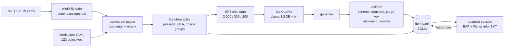

# EduAI

EduAI generates AP-style multiple-choice science questions with a LoRA-tuned Llama 3.2 3B. It
tags every question against a curriculum of learning objectives using embeddings, and it runs an
adaptive test that picks each next question from the student's responses so far. It covers four
AP sciences: Biology, Chemistry, Physics 1 and Environmental Science. The source material is
SciQ, and everything runs on one M1 Pro laptop.

<p>


</p>



## Quickstart (no model, no network)

```bash
make setup    # uv sync + pinned embedding models into .models/ (network allowed)
make demo     # bank-only app on http://127.0.0.1:8001
```

The demo serves a committed sample of 634 SciQ-derived items (`data/samples/bank_sample.jsonl`), so it
needs neither the raw dataset nor any model. To confirm the whole process tree runs without
network access:

```bash
offline-run make e2e-offline   # offline-run: sandbox-exec wrapper that denies outbound network
make egress-open-check                                                   # the same canary connects when unsandboxed
```

`e2e-offline` starts the API server and turns on an egress canary inside the server process. It
then runs a practice session and an assessment over localhost and fails if any process could
reach 1.1.1.1, api.openai.com or huggingface.co. CI runs the same script in a Linux container
started with `--network none`.

## Full pipeline

```bash
make data SCIQ_DIR=~/Downloads/SciQ\ dataset-2\ 3   # SciQ JSON -> tagged items, splits, SFT data, data card
make models-llm                                      # Llama 3.2 3B 4-bit (1.8 GB), pinned revision
uv run eduai fetch-adapter                           # or: make train (about 2 hours)
make serve                                           # full app; backend auto-selects MLX+adapter
make test
```

The backend is picked in this order: MLX with the adapter, then MLX base, then Ollama
(`llama3.2:3b`, base only; Ollama can't load the MLX adapter), then bank-only. You can force one
with `EDUAI_BACKEND=mlx|ollama|bank`.

## Curriculum

`curriculum/*.yaml` defines 123 learning objectives, organized as unit, then topic, then
objective. Each objective has keywords, a Bloom level, and one of our own blueprint weights. The
objective sentences and unit titles were written for this project, loosely following each AP
course's scope. See [curriculum/README.md](curriculum/README.md). This project isn't affiliated
with the College Board.

## Data

The data card is [reports/data_card.md](reports/data_card.md). Its sections appear in the order
the pipeline applies them:

1. **Eligibility gate.** 1,427 SciQ records have a blank `support` passage: 1,198 train, 113
   valid and 116 test.
   - These can't produce passage-grounded explanations, so they are kept out of SFT and eval.
   - They stay in the item bank flagged `ungrounded`, with no explanation.
   - Their blank passage never gets a hash, so they don't collapse into one split group.
2. **Curriculum alignment.** The tagger's score has to clear tau. The data card counts
   exclusions per split and per subject before any quota is applied.
3. **Split grouping.** Union-find links items that share a passage, have the same normalized
   question and answer, or have a bge cosine above 0.92 on question plus answer.
   - Each group goes to one split, with test taking priority, then valid, then train.
   - 813 items moved, and no group spans two splits.
4. **Quotas.** SFT is 3,000 / 300 / 200. The answer letter is exactly 25% each of A–D, 40% of
   items are stimulus style, and 30% carry a target misconception. All quotas were met.

The prompt lives in `prompts.py` and is shared by training and inference.
`tests/test_prompts.py` checks that no other module builds a generation prompt.

Here is an example SFT pair, abridged from `data/samples/sft_sample.jsonl`:

```
user:  Subject: AP Biology / Unit: Energy in cells / Topic: Photosynthesis
       Learning objective (BIO.3.2.a): Describe how the light reactions and the Calvin cycle ...
       Difficulty: easy / Format: stimulus / Source passage: The primary function of leaves is ...
assistant: {"stem": "Based on the excerpt, the process by which leaves collect sunlight and make food
       is called this?", "stimulus": "...", "choices": {"A": "glycolysis", "B": "photosynthesis", ...},
       "answer": "B", "explanation": "B is correct. The primary function of leaves is ...", ...}
```

## Fine-tuning

The fine-tune is mlx-lm 0.31.3 LoRA on `mlx-community/Llama-3.2-3B-Instruct-4bit`
([configs/lora_llama32_3b.yaml](configs/lora_llama32_3b.yaml)). Settings: rank 8, the last 16
layers, lr 2e-5, 600 iterations at batch 4, prompt masked, and gradient checkpointing. Both runs
held the shared compute lease.

| Run | Iterations | Wall time | Peak memory | Train tokens/s | Source |
|---|---|---|---|---|---|
| Pilot | 20 | 240 s | 6.60 GB | 56.2 | `reports/pilot.json` |
| Full | 600 | 6,995 s (1.94 h) | 7.65 GB | 56.7 | `reports/training.json` |

The pilot projected 1.68 h, which was under the 2.5 h fallback threshold, so the 3B model with 16
layers ran as planned. The run trained 6.95M parameters on 348K target tokens.


Validation loss fell from 0.937 to 0.293. Almost all of that drop happens in the first 100
iterations, and the loss is mostly about the output format. In the validation targets, 37% of
completion tokens are JSON syntax, and 41% sit inside spans copied verbatim from the prompt
([reports/target_token_share.json](reports/target_token_share.json)). The training
explanations are extracted passage sentences, so the model learns to extract, not to explain.

The adapter is not committed. It ships as a release asset whose sha256 and size are listed in
[adapters/MANIFEST.json](adapters/MANIFEST.json). The CUDA route is
[notebooks/colab_qlora_peft.ipynb](notebooks/colab_qlora_peft.ipynb) (QLoRA with PEFT and TRL).
That notebook is a reference and hasn't been run.

## Curriculum tagging

The tagger works in four steps. A subject gate compares the item against subject centroids.
bge-small then retrieves the top 10 objectives, and the ms-marco MiniLM cross-encoder reranks
them. Finally, tau is calibrated as the 20th percentile of gold-objective scores. Here are the
results on the 150-item gold set ([reports/tagger_eval.md](reports/tagger_eval.md)):

| Mode | Top-1 | Top-3 | Unit | Subject | Aligned (CV) | Off-curriculum rejected (CV) |
|---|---|---|---|---|---|---|
| all-MiniLM-L6-v2 | 49.1% | 75.4% | 64.9% | 87.7% | 65.8% | 61.1% |
| bge-small-en-v1.5 | 36.8% | 71.9% | 64.0% | 84.2% | 65.8% | 52.8% |
| bge-small + rerank | 50.9% | 77.2% | 66.7% | 87.7% | 68.4% | 55.6% |

Treat the tagger as a noisy filter.
- It wrongly rejects about 30% of in-curriculum items, and it passes about 44% of off-curriculum
  ones.
- The reranker adds little over plain MiniLM.
- Because of this, LO conditioning in generation is weakly supervised. The app only serves
  aligned items, and it reports mastery at the unit level.

The gold labels, and the independent eval-prompt labels described below, came from an AI
labeling pass that never saw tagger output. They still need a human spot-check.

## Generation eval

EVAL_SECTION

## Adaptive testing and feedback

The whole system uses one response model, p = c + (1 − c)·σ(θ − b) with c = 0.25 for four
options (`kt/irt.py`).

- **Assessment.** The ability estimate is the EAP posterior on a 161-point grid with a N(0, 1)
  prior.
  - Each next item maximizes Fisher information I = p′² / (p(1 − p)). Under this model the peak
    falls at p* = (1 + √(1 + 8c)) / 4 ≈ 0.683, not at 0.5.
  - The only stopping rule is posterior SD below a threshold or a cap on the number of items.
  - Tests check the information against a finite-difference p′, check that the argmax matches p*
    for c ∈ {0, 0.2, 0.25}, and check the grid posterior against a fine-grid reference.
- **Practice.** Items are chosen to target p = 0.7. That target is a desirable-difficulty
  choice for teaching, not an information-maximizing one.
  - The next learning objective comes from a UCB score over BKT mastery, within the unit
    blueprint quotas.
- **Item calibration.** An Elo-style step on the same p runs inside a SQLite transaction. It
  uses θ from the student's EAP estimate before the response. An item keeps its label
  difficulty until it has 5 responses.
- **Mastery.** Per-objective BKT with difficulty-adjusted guess and slip, plus a Baum-Welch EM
  fit. Unit mastery is averaged over the objectives the student has actually seen.

These numbers are from 500 simulated students per condition ([reports/sim_report.md](reports/sim_report.md)):


| Stop when SD < | Coverage of true θ by θ̂ ± 1.96 SD | RMSE | Mean length | Stopped by precision (cap 80) |
|---|---|---|---|---|
| 0.3 | 95.2% | 0.302 | 72.2 | 91.2% |
| 0.4 | 94.6% | 0.386 | 38.6 | 100% |
| 0.5 | 95.8% | 0.476 | 23.2 | 100% |

- **Posterior SD is well calibrated at every threshold.** An SD of 0.3 takes about 72 items even
  when every item is well targeted, so the web assessment stops at SD < 0.5 or 30 items.
- **Adaptive assessment has the lowest error at every length from 10 items on.**
  - At 40 items its RMSE is 0.379, against 0.425 for random items and 0.463 for a fixed form.
  - Early on the gap is small. At 5 items random selection is slightly better (0.760 vs 0.782).
- **Adaptive practice leaves students with more mastery.** After 300 questions the mean true
  mastery is 83.5%, against 76.9% for random objectives. 75% of students reach 80% mastery,
  against 55%.
- **Elo calibration beats the label once responses accumulate.** RMSE of b drops from 0.514
  with labels alone to 0.407 after 20 responses and 0.246 after 160. A gain of 0.6 made things
  worse (0.582 at 5 responses), so the gain is 0.15.
- **Evidence sharing between neighboring objectives didn't help.** The Brier score was 0.2021
  with sharing and 0.1946 without, so it is off in the app.
- **The EM guess estimate hit its 0.49 bound.** That is model mismatch: correct answers driven
  by ability look like guessing to two-state BKT. It is reported, not tuned away.

All of this is simulation, and the responses come from the same model the system assumes.
The results show the estimators behave as designed. They say nothing about real students.

## App

The app is FastAPI with Jinja and htmx, plus a JSON API under `/api/` and SQLite storage.

- **Practice mode** gives feedback and the source-passage explanation after each answer.
- **Assessment mode** shows no feedback. It shows a live ability estimate with its SD and the
  stopping target.
- **The report** shows a θ trajectory with its SD band, unit mastery with counts, wrong answers
  worth revisiting, and a full response log.
- **The 1–5 score is illustrative**, and the page labels it as simulated.


## Limitations

- **The data is narrow.**
  - SciQ questions are short recall items written by crowdworkers.
  - Physics 1 and APES coverage is thin, and many SciQ items are off-curriculum (astronomy,
    anatomy trivia).
  - The "AP-style" framing comes from the prompt and format. The source material is not AP level.
- **Explanations are extracted, not reasoned.** Stimulus items reuse passage sentences.
- **All judges are small.**
  - The key check uses Llama 3.2 1B as an open-book judge.
  - The alignment check is the noisy tagger above.
  - Neither replaces human review.
- **Both gold sets need review.** They were labeled by an AI pass and are waiting for a human
  spot-check.
- **Adaptive-testing results come from simulated students only.**
- **Some paths weren't verified here.** The CUDA/Colab notebook and `HFBackend` never ran on
  this machine (no NVIDIA GPU), and the Ollama backend was not tested with a pulled model.
- **SFT v1 splits predate two fixes.** They were built before the passage-containment link
  (`eduai data build --containment-link`) was added, and before the alignment rule compared the
  target objective's own score.
  - The eval prompts are filtered against the training rows the adapter actually saw.
  - `configs/sft_v1.sha256` pins the files the adapter was trained on.

## Credits and licenses

The code is MIT. SciQ is CC BY-NC 3.0, so the samples, eval outputs and adapter are
non-commercial. The models are Llama 3.2 under the Llama 3.2 Community License ("Built with
Llama"). The embedders are bge-small (MIT) and MiniLM (Apache-2.0). See
[DATA_LICENSES.md](DATA_LICENSES.md). AP is a registered trademark of the College Board, which
isn't affiliated with this project.
