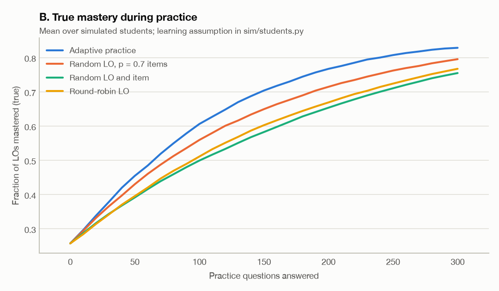
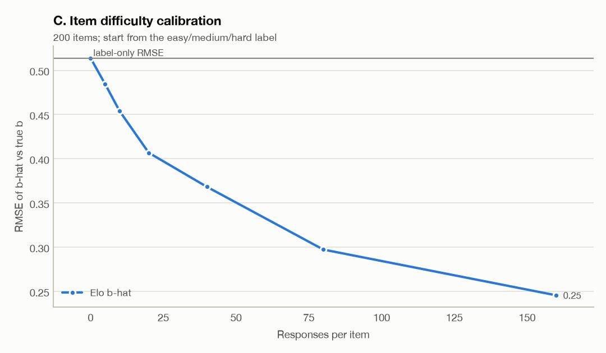
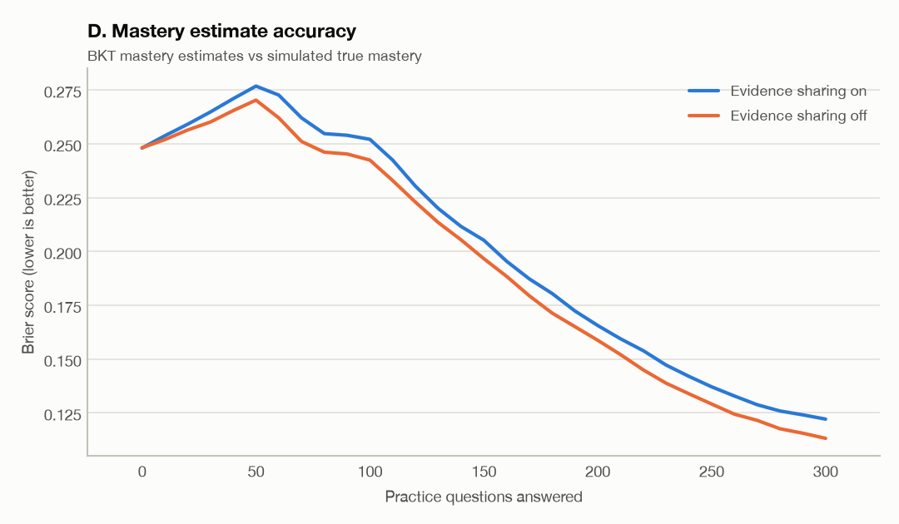

# Simulation report

Generated by `eduai simulate` (500 synthetic students per condition, seed 20260723, subject BIO, 12 items per LO). Run time 110.1 s. Manifest: `sim_manifest.json`.

These results come from a simulation under the assumptions in `src/eduai/sim/students.py`. Responses are drawn from the same model the system uses, so the results describe estimator and policy behavior when that model is correct. They do not describe real students.

Response model: p = c + (1 - c) sigmoid(theta - b), c = 0.25. Fisher information peaks at p* = 0.683, where one item carries I = 0.155.

## A. Assessment

RMSE of the EAP estimate by test length (fixed length, no early stop):

| Policy | 5 items | 10 items | 15 items | 20 items | 30 items | 40 items | 60 items |
|---|---|---|---|---|---|---|---|
| adaptive | 0.773 | 0.670 | 0.580 | 0.518 | 0.444 | 0.390 | 0.318 |
| adaptive-free | 0.779 | 0.681 | 0.582 | 0.531 | 0.437 | 0.380 | 0.317 |
| random | 0.802 | 0.677 | 0.617 | 0.543 | 0.476 | 0.416 | 0.366 |
| fixed | 0.803 | 0.707 | 0.617 | 0.569 | 0.477 | 0.429 | 0.381 |
| adaptive (label b, uncalibrated) | 0.786 | 0.677 | 0.595 | 0.537 | 0.470 | 0.413 | 0.350 |

Paired difference in squared error, adaptive minus the other policy, over the same students (negative favors adaptive), mean with a 95% bootstrap CI:

| vs | 5 items | 10 items | 15 items | 20 items | 30 items | 40 items | 60 items |
|---|---|---|---|---|---|---|---|
| random | -0.045 [-0.124, +0.036] | -0.009 [-0.081, +0.060] | -0.044 [-0.101, +0.013] | -0.026 [-0.075, +0.021] | -0.029 [-0.064, +0.007] | -0.021 [-0.049, +0.006] | -0.033 [-0.053, -0.014] |
| fixed | -0.048 [-0.135, +0.035] | -0.051 [-0.124, +0.020] | -0.044 [-0.103, +0.015] | -0.055 [-0.110, -0.005] | -0.030 [-0.065, +0.003] | -0.032 [-0.060, -0.005] | -0.044 [-0.068, -0.023] |

Calibration under the stopping rule (stop when the EAP posterior SD drops below the threshold, or at 80 items). Coverage is the share of students whose true theta falls in theta-hat +/- 1.96 SD. 1/sqrt(sum I) is shown for comparison only; it is not used to stop.

| SD threshold | Coverage (95% target) | RMSE | Mean reported SD | Mean 1/sqrt(sum I) | Mean length | Median length | Stopped by precision |
|---|---|---|---|---|---|---|---|
| 0.3 | 95.8% | 0.292 | 0.300 | 0.311 | 71.6 | 71 | 93.2% |
| 0.4 | 95.0% | 0.377 | 0.397 | 0.423 | 38.7 | 38 | 99.8% |
| 0.5 | 95.2% | 0.495 | 0.495 | 0.552 | 22.9 | 23 | 100.0% |

At a fixed 20 responses the mean posterior SD is 0.523 while the mean 1/sqrt(sum I) is 0.591 (RMSE 0.484).

## B. Practice

Learning assumption: an attempt teaches an unmastered objective with probability peaking at p = 0.7, which is also the practice-mode target. The adaptive arm is therefore built to benefit from the assumption; the random-LO + targeting arm keeps the item targeting and randomizes only the objective, which separates the two effects.

| Policy | Mean true mastery after 300 questions | Reached 80% mastery | Median questions to 80% | Adaptive minus this (final mastery, 95% CI) |
|---|---|---|---|---|
| adaptive | 82.9% | 74.6% | 198 |  |
| random-lo-targeted | 79.5% | 61.6% | 256 | +3.3 pts [+2.6, +4.0] |
| random | 75.5% | 53.8% | 286 | +7.4 pts [+6.6, +8.2] |
| round-robin | 76.7% | 56.8% | 274 | +6.1 pts [+5.3, +6.9] |

BKT parameters were fit by EM on a separate cohort of random-practice sequences: p_init 0.496, p_learn 0.077, guess 0.490, slip 0.117 (log-likelihood -33391.4 to -31807.7 over 34 iterations). The guess estimate sits on its 0.49 upper bound: the simulated responses include ability-driven correct answers that a two-state BKT model can only explain as guessing, so this is a model-mismatch signal rather than a real guess rate. The app uses difficulty-adjusted defaults instead.

## C. Item calibration

Each response moves b by K(n) (y - p), K(n) = 0.15 / (1 + 0.02 n), with p computed from the student's pre-response EAP estimate (true ability is never used). The app serves the label difficulty until an item has 5 responses.

| Responses per item | 0 | 5 | 10 | 20 | 40 | 80 | 160 |
|---|---|---|---|---|---|---|---|
| RMSE of served b | 0.514 | 0.485 | 0.454 | 0.407 | 0.368 | 0.297 | 0.246 |
| RMSE of raw b-hat | 0.514 | 0.474 | 0.449 | 0.407 | 0.368 | 0.297 | 0.246 |

Label-only baseline (easy/medium/hard mapped to -1/0/+1): RMSE 0.514. Gain sensitivity (raw b-hat, no label hold):

| K0 | 0 | 5 | 10 | 20 | 40 | 80 | 160 |
|---|---|---|---|---|---|---|---|
| 0.1 | 0.514 | 0.481 | 0.461 | 0.425 | 0.384 | 0.321 | 0.265 |
| 0.15 | 0.514 | 0.474 | 0.450 | 0.407 | 0.368 | 0.297 | 0.246 |
| 0.3 | 0.514 | 0.481 | 0.460 | 0.420 | 0.407 | 0.315 | 0.270 |
| 0.6 | 0.514 | 0.582 | 0.582 | 0.538 | 0.547 | 0.413 | 0.360 |

## D. Evidence sharing

| Condition | Mean Brier over the session | Mean true mastery at end |
|---|---|---|
| sharing_on | 0.2062 | 82.4% |
| sharing_off | 0.2038 | 82.7% |
